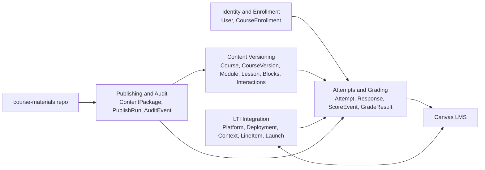
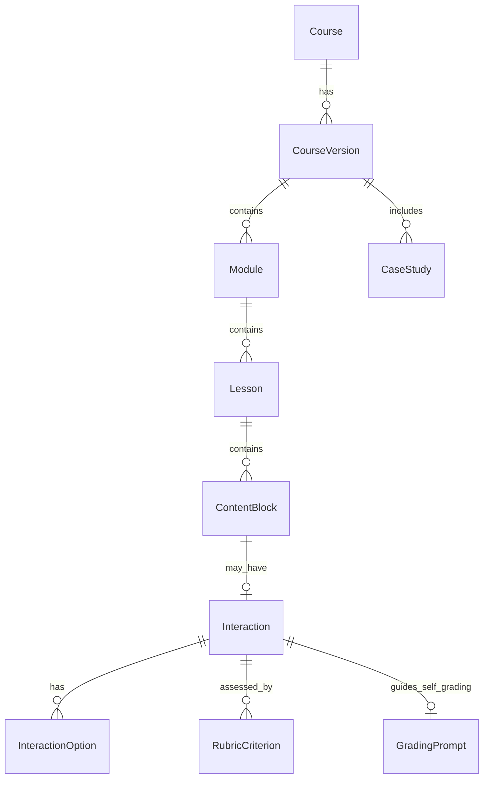
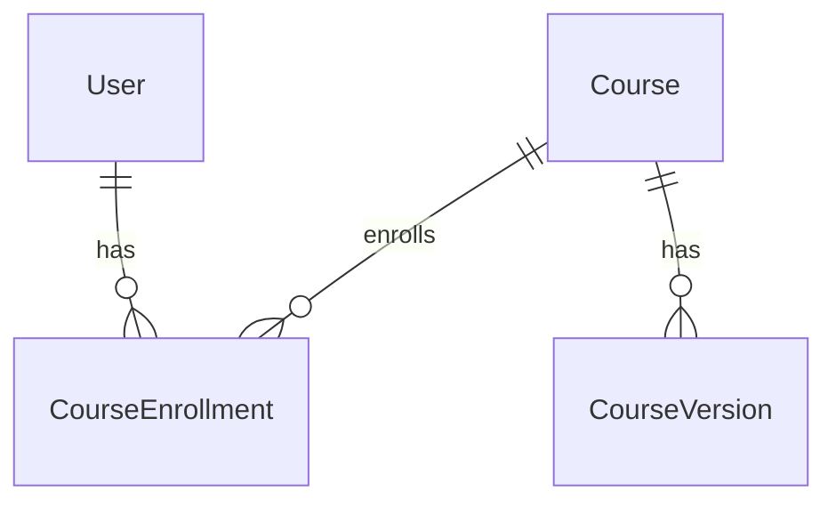
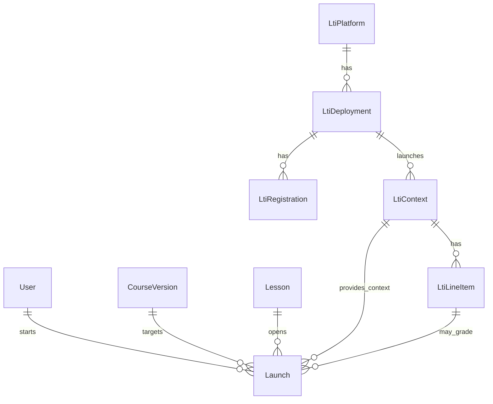
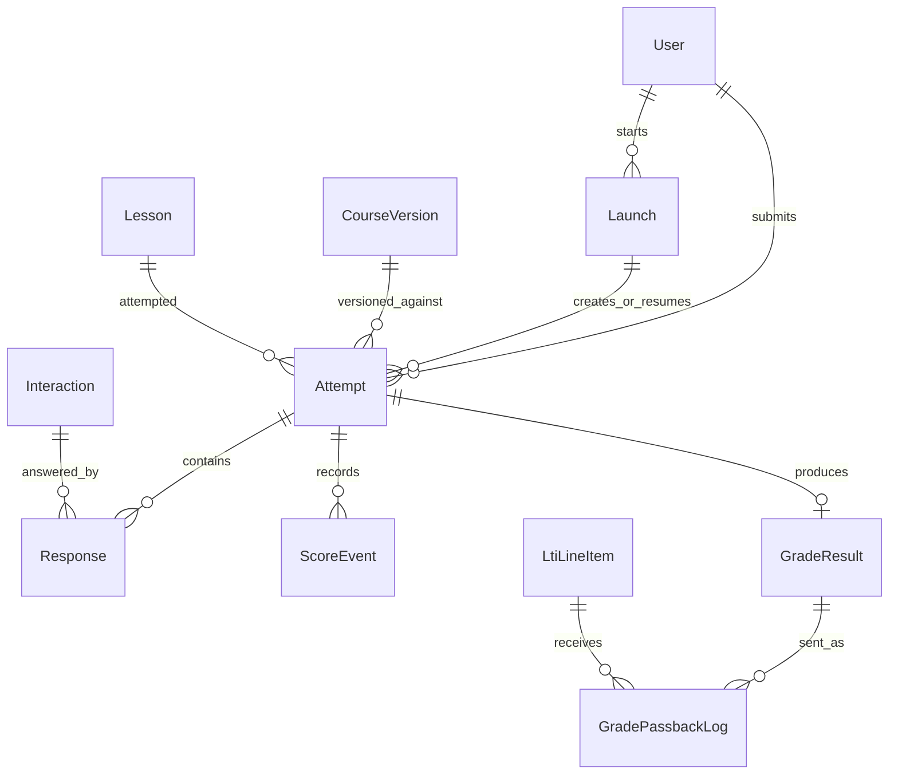
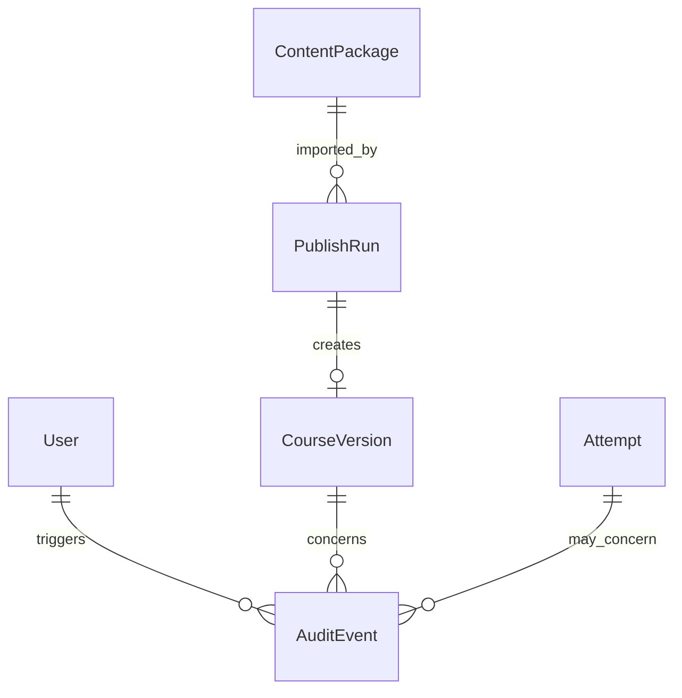

# Database Schema Design

## Goals

The database must support:

- versioned course content
- standalone and LTI-based launches
- student attempts and responses
- automatic grading and self-guided grading with grading prompts
- Canvas grade passback through LTI Assignment and Grade Services
- content publishing from `learn-database/course-materials`
- auditability for launches, submissions, solution reveals, and grade passback

## Schema Groups

```text
Content
  Course
  CourseVersion
  Module
  Lesson
  ContentBlock
  Interaction
  InteractionOption
  Rubric
  RubricCriterion
  GradingPrompt
  CaseStudy

Identity and Enrollment
  User
  CourseEnrollment

LTI
  LtiPlatform
  LtiDeployment
  LtiRegistration
  LtiContext
  LtiLineItem
  Launch

Attempts and Grading
  Attempt
  Response
  ScoreEvent
  GradeResult
  GradePassbackLog

Publishing and Audit
  ContentPackage
  PublishRun
  AuditEvent
```

## Entity Relationship Diagrams

The schema is shown in several focused diagrams to avoid line overlap. Use the
high-level map first, then review the focused diagrams for table-level
relationships.

### High-Level Schema Map



### Content Versioning ERD



### Identity And Enrollment ERD



### LTI Launch ERD



### Attempts And Grading ERD



### Publishing And Audit ERD



## Core Tables

### `Course`

Represents a course family, such as Learn Database or ITM-2100.

Key fields:

```text
id
slug
title
description
createdAt
updatedAt
```

### `CourseVersion`

Represents a frozen version of course content. Student attempts must attach to a course version.

Key fields:

```text
id
courseId
versionLabel
sourceCommitSha
status              draft | preview | active | archived
publishedAt
createdAt
updatedAt
```

### `Module`

Represents one module inside a course version.

Key fields:

```text
id
courseVersionId
moduleNumber
slug
title
overviewMarkdown
sortOrder
```

### `Lesson`

Represents one lesson inside a module.

Key fields:

```text
id
moduleId
lessonNumber
slug
title
studentMarkdown
instructorMarkdown
estimatedMinutes
sortOrder
```

### `ContentBlock`

Represents an ordered workbook block within a lesson.

Key fields:

```text
id
lessonId
blockType           content | case_card | interaction | reflection | project_checkpoint
title
bodyMarkdown
sourcePath
sortOrder
```

### `Interaction`

Represents an interactive task associated with a block.

Key fields:

```text
id
contentBlockId
interactionType     choice | multi_select | short_answer | essay | sql | sql_choice | sql_short_answer | checklist | matching | matrix
promptMarkdown
points
scoringMode         automatic | self_graded
solutionJson
feedbackJson
gradingPromptId
settingsJson
```

Interactions should not require normal instructor grading. Written responses,
design-judgment prompts, reflections, and project checkpoints should use
`self_graded` mode with a student-facing grading prompt, rubric, checklist, or
sample answer.

### `GradingPrompt`

Stores the self-grading guidance shown to students.

Key fields:

```text
id
interactionId
promptMarkdown
sampleAnswerMarkdown
rubricJson
selfScoreMode       complete_incomplete | points | checklist
showBeforeSubmit
showAfterSubmit
```

### `InteractionOption`

Stores choices, matching items, matrix row/column labels, or checklist items.

Key fields:

```text
id
interactionId
optionKey
labelMarkdown
isCorrect
metadataJson
sortOrder
```

### `User`

Represents a person known to the platform. Canvas users and standalone users should map here.

Key fields:

```text
id
email
displayName
externalSubject
createdAt
updatedAt
```

### `CourseEnrollment`

Represents a user's role in a course.

Key fields:

```text
id
courseId
userId
role                student | instructor | designer | admin
source              standalone | lti
createdAt
updatedAt
```

### `Attempt`

Represents a student's attempt for one lesson or assignment launch.

Key fields:

```text
id
userId
courseVersionId
lessonId
launchId
status              in_progress | submitted | graded | abandoned
startedAt
submittedAt
lastActivityAt
score
maxScore
```

### `Response`

Stores one answer to one interaction.

Key fields:

```text
id
attemptId
interactionId
responseJson
score
maxScore
status              unanswered | saved | correct | incorrect | self_checked | self_scored
feedbackJson
selfGradeJson
gradingPromptShownAt
createdAt
updatedAt
```

### `GradeResult`

Stores the final grade calculation for an attempt.

Key fields:

```text
id
attemptId
score
maxScore
scoreGiven
scoreMaximum
gradingStatus       pending | calculated | self_graded | passback_sent | passback_failed
calculatedAt
updatedAt
```

### `GradePassbackLog`

Audit log for Canvas/LTI grade passback.

Key fields:

```text
id
gradeResultId
ltiLineItemId
attemptId
requestJson
responseJson
status              queued | sent | failed | retrying
errorMessage
sentAt
createdAt
```

## LTI Tables

### `LtiPlatform`

Represents an LMS platform such as Canvas.

Key fields:

```text
id
issuer
name
authLoginUrl
authTokenUrl
jwksUrl
clientId
createdAt
updatedAt
```

### `LtiDeployment`

Represents one LMS deployment of this tool.

Key fields:

```text
id
ltiPlatformId
deploymentId
organizationName
status              active | disabled
createdAt
updatedAt
```

### `LtiContext`

Represents an LMS course/context.

Key fields:

```text
id
ltiDeploymentId
contextId
contextLabel
contextTitle
courseId
createdAt
updatedAt
```

### `LtiLineItem`

Represents a Canvas assignment gradebook line item.

Key fields:

```text
id
ltiContextId
lineItemUrl
label
resourceLinkId
resourceId
tag
scoreMaximum
createdAt
updatedAt
```

### `Launch`

Represents one platform launch from standalone mode or LTI mode.

Key fields:

```text
id
launchType          standalone | lti
userId
courseVersionId
lessonId
ltiContextId
ltiLineItemId
rolesJson
claimsJson
launchedAt
```

## Publishing Tables

### `ContentPackage`

Represents a built package from the content repository.

Key fields:

```text
id
sourceRepo
sourceCommitSha
packageVersion
manifestJson
createdAt
```

### `PublishRun`

Represents one import/publish operation.

Key fields:

```text
id
contentPackageId
courseVersionId
status              started | validated | imported | failed
logJson
startedAt
finishedAt
```

## Important Design Decisions

- Content is versioned before students use it.
- Attempts reference the versioned lesson, not a mutable lesson draft.
- Canvas grade passback is logged separately from grade calculation.
- LTI launch data is stored enough to debug role, context, and line-item mapping issues.
- Written and design-judgment responses use self-grading prompts rather than normal instructor grading.
- Exceptional instructor score overrides, if added later, must be audit-only and should not be the standard course flow.
- Content authoring remains in `course-materials`; the database stores published runtime content.
