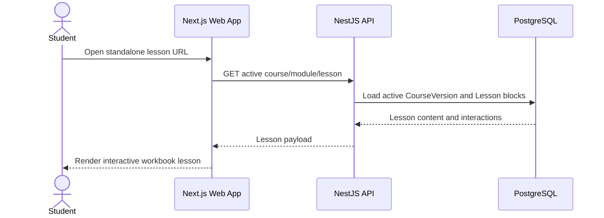
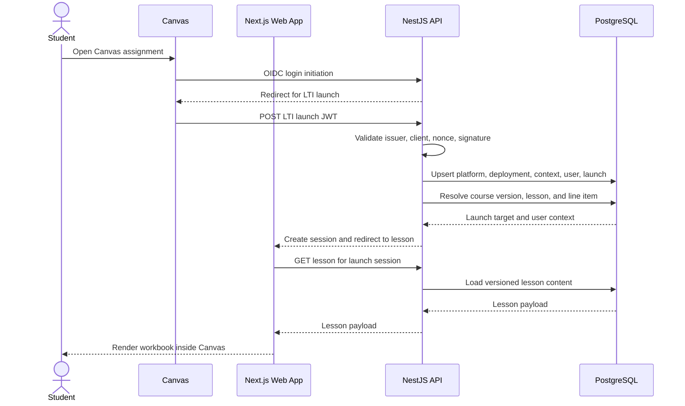
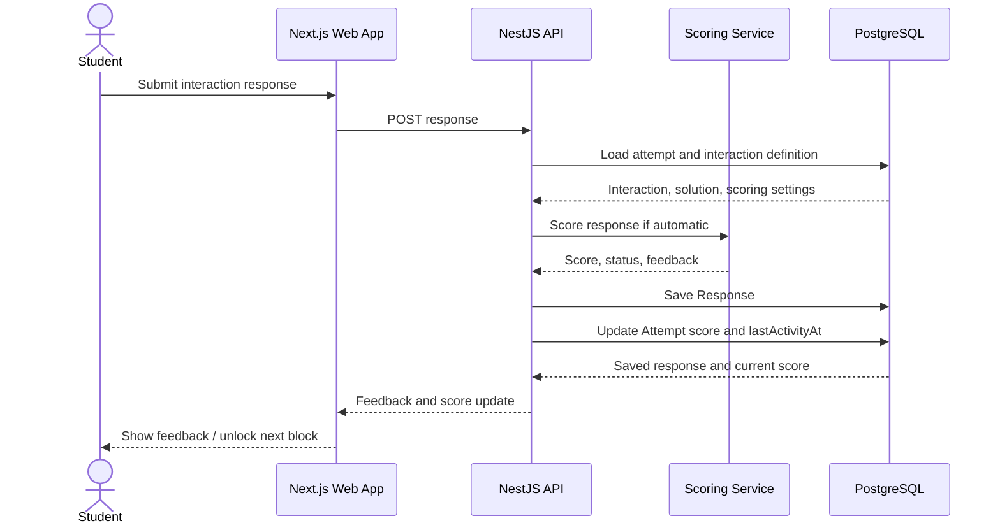
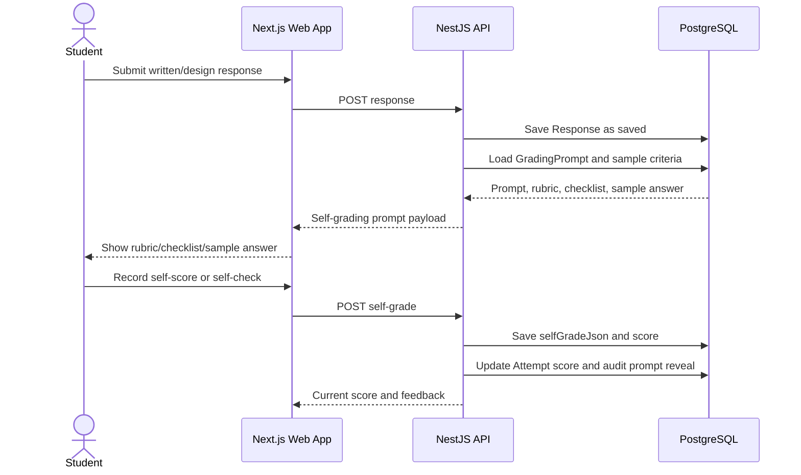
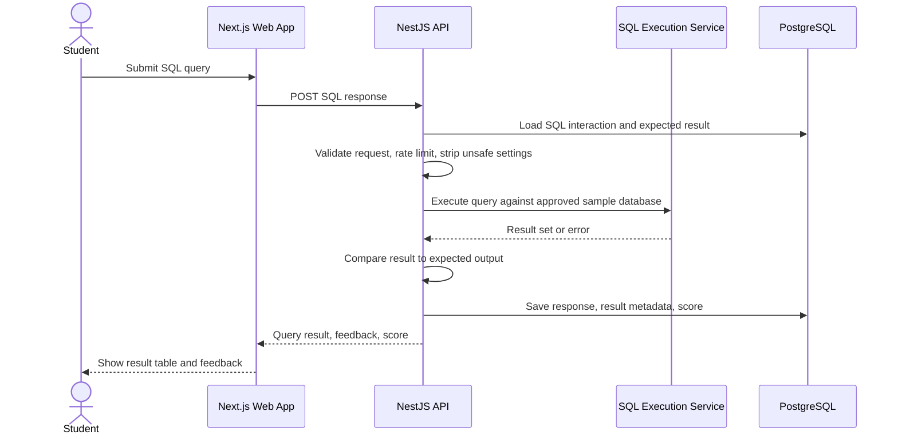
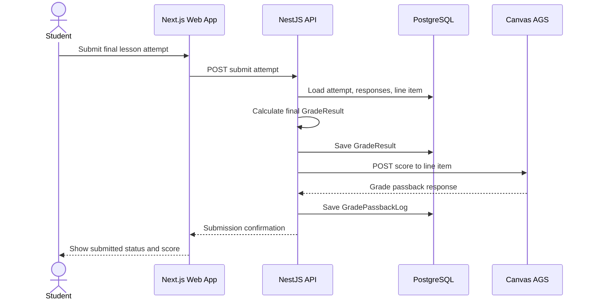
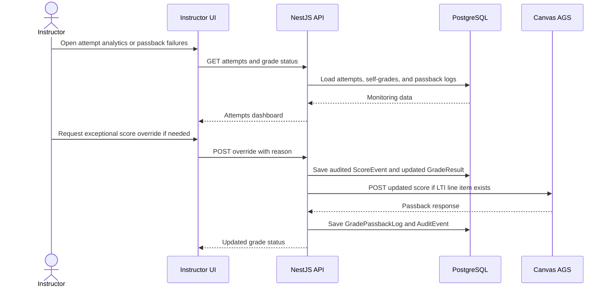
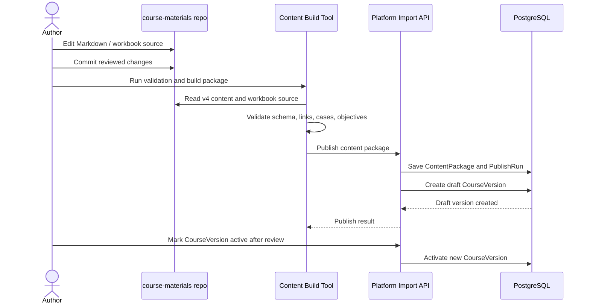
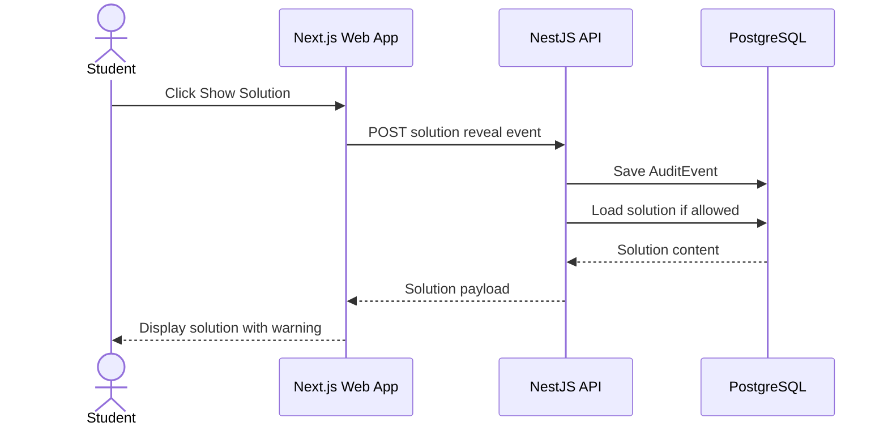

# Sequence Diagrams

## Standalone Lesson Launch

## Canvas LTI Launch

## Save Response And Automatic Score

## Self-Graded Interaction

## SQL Interaction Through Backend Proxy

## Canvas Grade Passback

## Instructor Monitoring And Exceptional Override

## Content Publish From `course-materials`

## Solution Reveal Audit

