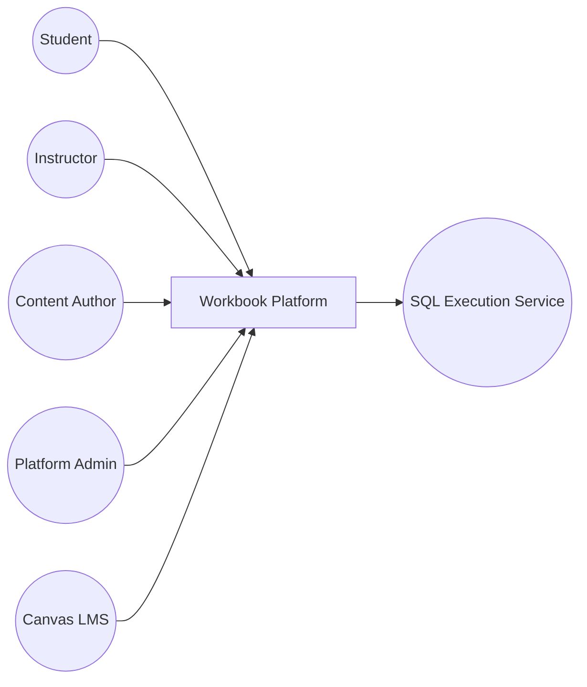
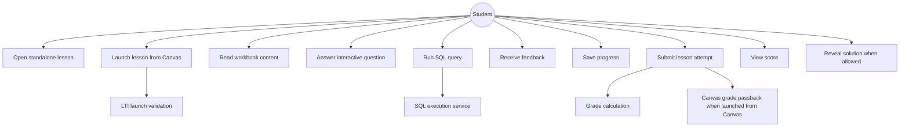
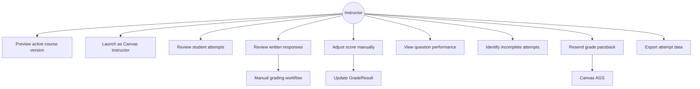
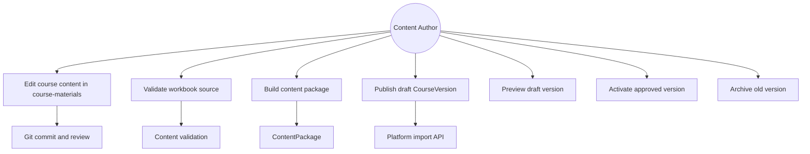
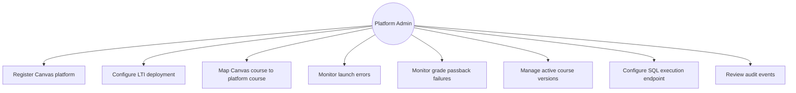
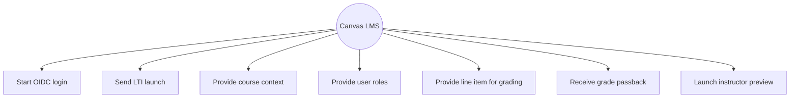
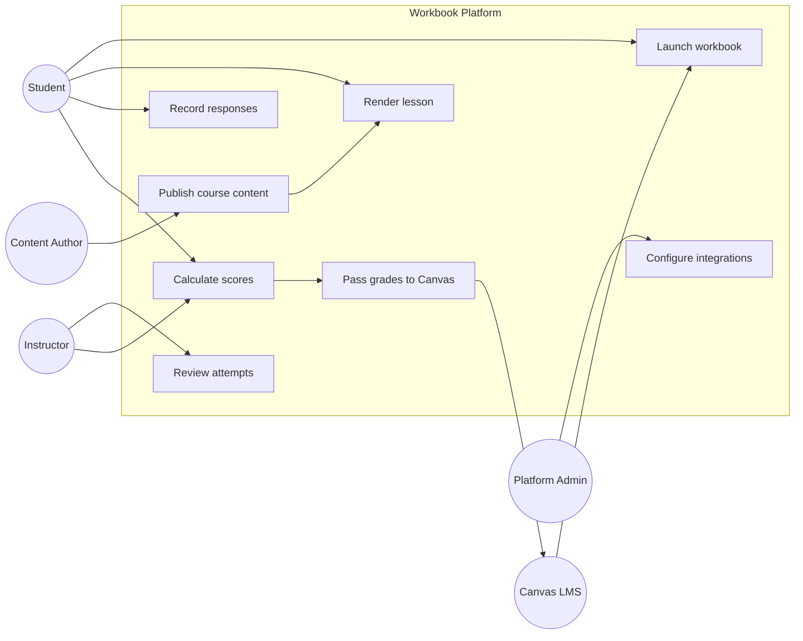
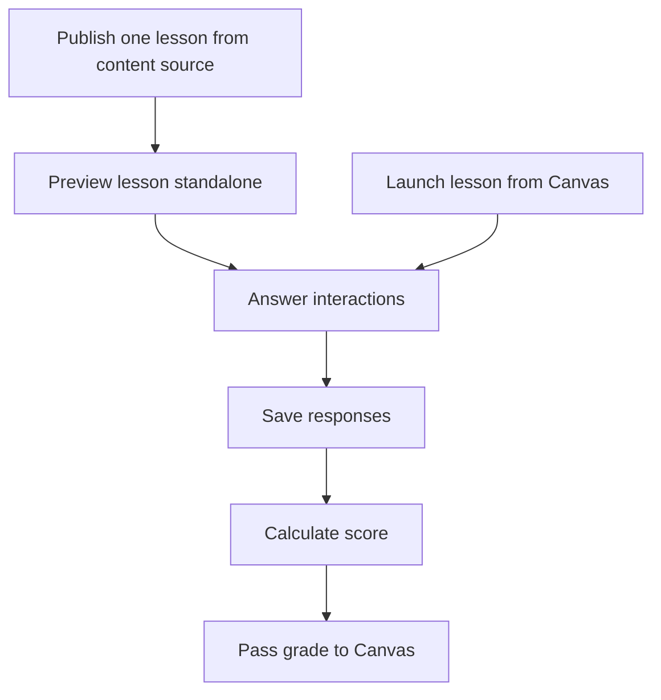

# Use Cases

## Actors



## Student Use Cases



## Instructor Use Cases



## Content Author Use Cases



## Platform Admin Use Cases



## Canvas LMS Use Cases



## High-Level System Use Case Map



## MVP Use Cases

The MVP should implement only these use cases first:



Recommended first lesson for MVP:

```text
Lesson 3.2 Relationships and Cardinality
```

Reason:

- it exercises content blocks, choice questions, short answers, and self-checks
- it does not require full SQL sandboxing
- it supports the Lakeside/clinic relationship-pattern strategy
- it gives enough grading behavior to test Canvas passback
